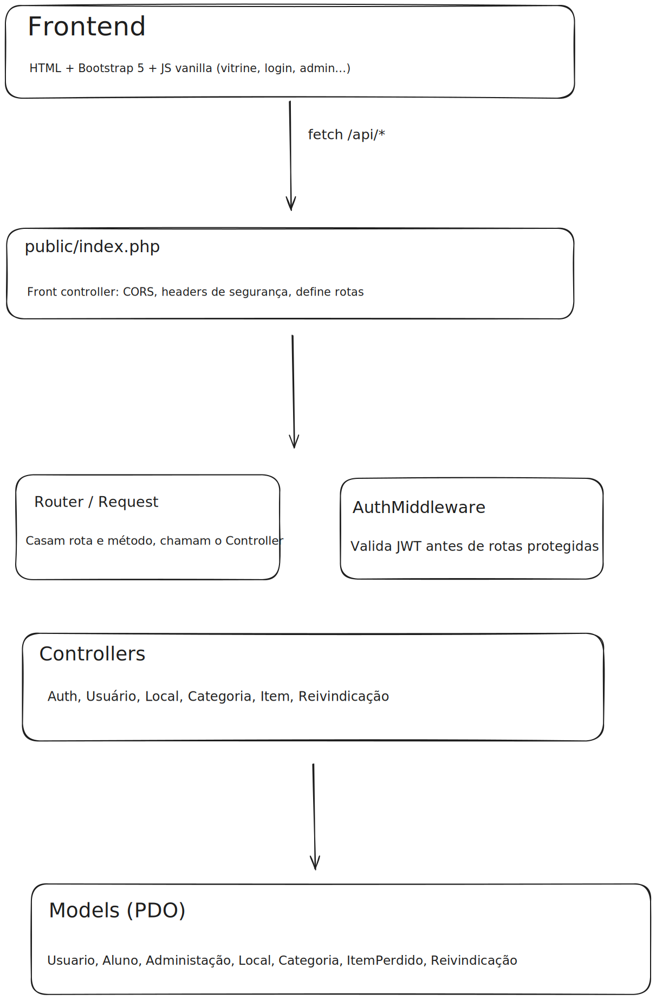
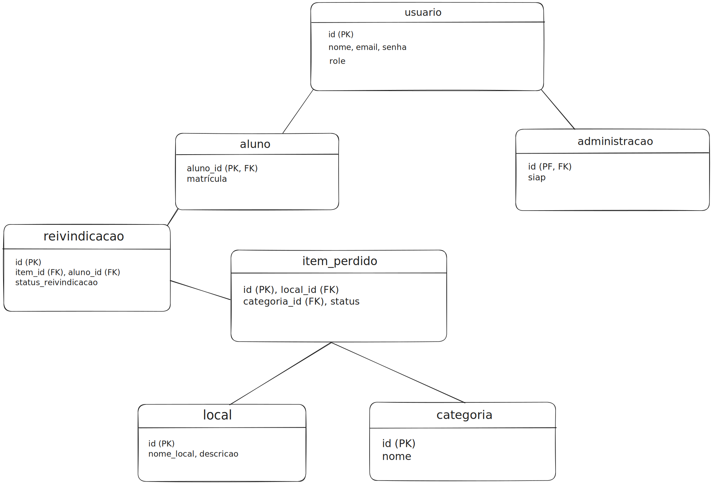
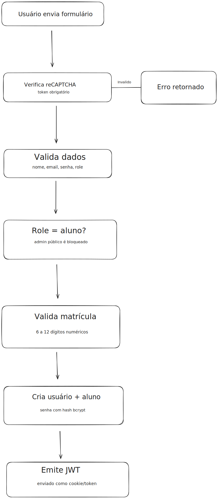
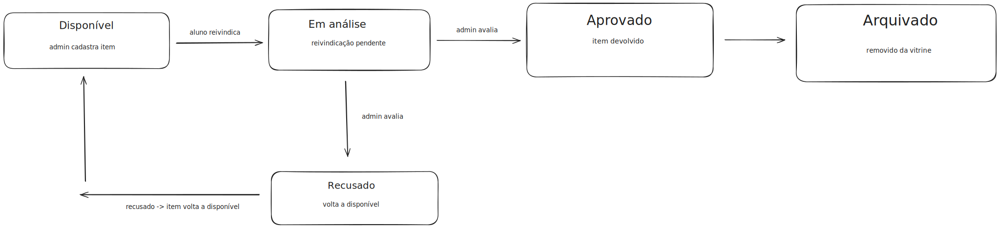
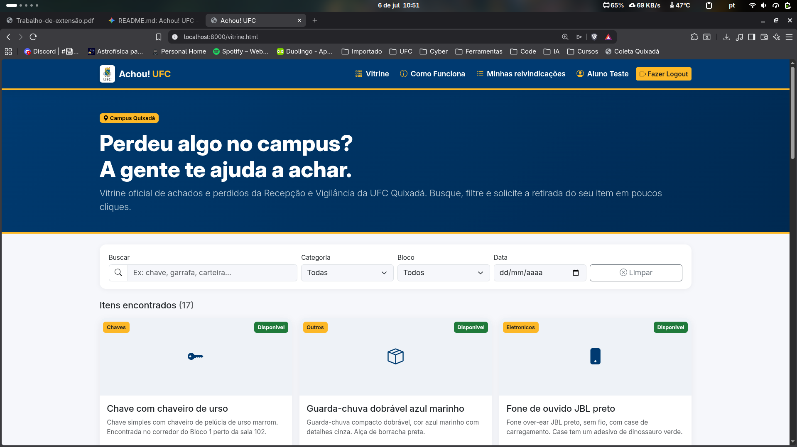
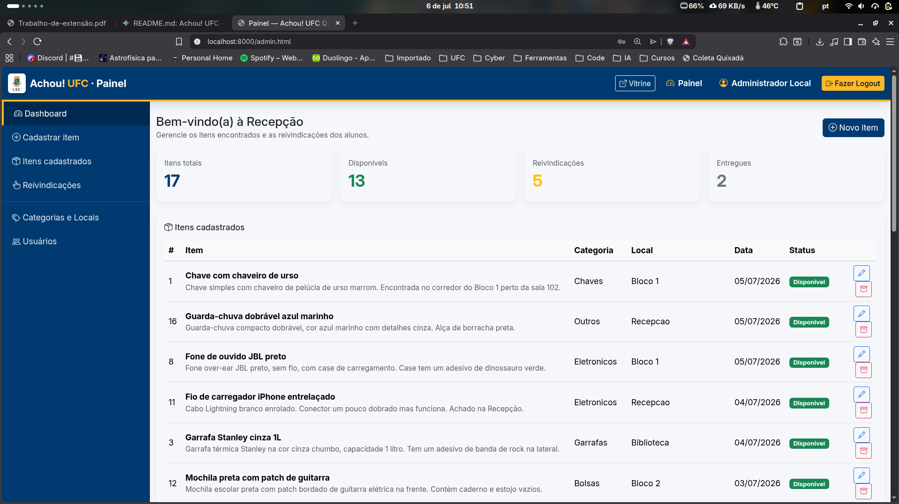
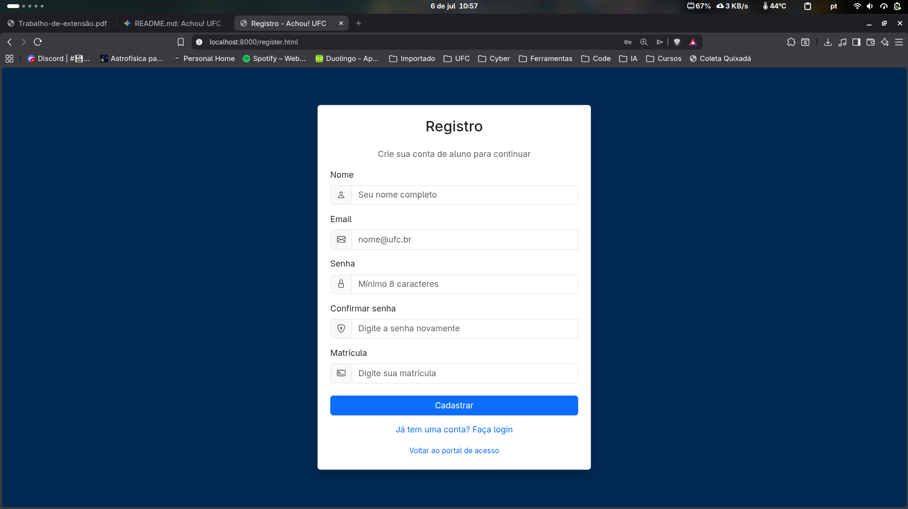
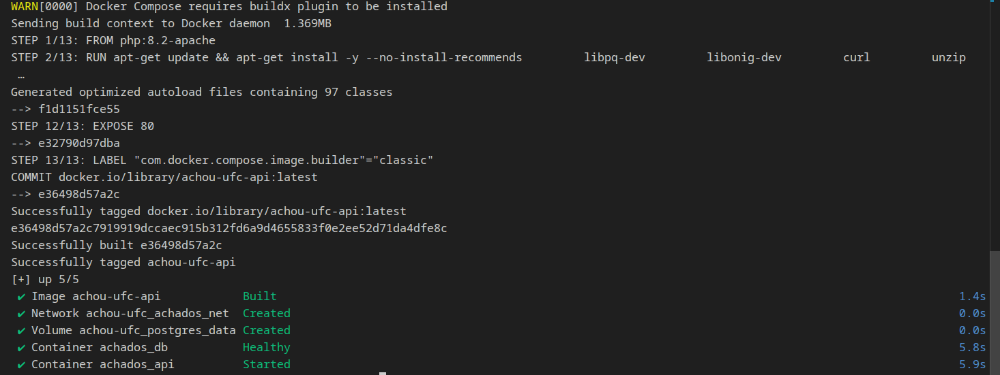

# Achou! UFC — Sistema de Achados e Perdidos

## Identificação

- **Nome do projeto:** Achou! UFC
- **Integrantes da dupla:**
  - Calebe Mesquita da Silva
  - Iago de Oliveira Lô
- **Disciplina:** Administração de Sistemas Operacionais
- **Semestre:** 5ª

## Organização atendida

**Descrição da organização**

O projeto foi desenvolvido para o **Setor de Achados e Perdidos da Universidade Federal do Ceará (UFC) — Campus Quixadá**, setor responsável por receber, guardar e devolver objetos perdidos encontrados nas dependências do campus.

**Contexto do problema**

O setor de achados e perdidos da UFC, até então, armazenam os dados de alunos, de objetos e das reivindicações de forma física, em um papel. Além disso, as informações são dispostas de maneira descentralizada, sem um ponto fico em que todas as informações estão dispostas para uma melhor organização. Outro ponto também é a necessidade de ir até o achados e perdidos para se ter a informação de que o objeto foi ou não encontrado e está lá pronto para ser retirado.

## Diagnóstico

**Situação encontrada**

- Sem acesso remoto a informações sobre objetos achados;
- Armazenamento físico de informações sobre objetos encontrados (registros em caderno/papel);
- Descentralização das informações, dificultando a busca e o controle de fluxo por parte dos responsáveis pelo achados e perdidos;
- Ausência de um servidor dedicado e padronizado para hospedagem de aplicações internas da recepção/vigilância;
- Falta de automação, isolamento de recursos e controle de segurança de rede (headers, rate limiting na infraestrutura) no ambiente local atual.

**Dificuldades identificadas**

- **Retrabalho operacional:** Os servidores da portaria perdem tempo produtivo atendendo alunos presencialmente apenas para checar listas físicas de itens perdidos.
- **Risco de perda e vazamento de dados:** O registro em papel não possui backup, auditoria de acesso ou controle sobre quem visualiza os dados pessoais de quem perdeu ou reivindicou um item.
- **Dificuldade de implantação e padronização:** Falta de uma infraestrutura conteinerizada que garanta que o sistema funcione com as mesmas dependências, isolamento e segurança de portas independentemente do hardware hospedeiro do setor.

**Para a comunidade (alunos/usuários)**

- **Vitrine digital:** visualização de todos os itens encontrados no campus.
- **Filtros inteligentes:** pesquisa de itens por texto, categoria, bloco (local) e data.
- **Reivindicação de itens:** formulário para solicitar a devolução de um objeto, no qual o aluno deve comprovar a posse.
- **Autenticação:** registro e login de alunos utilizando a matrícula institucional.

**Para a administração (Recepção)**

- **Painel administrativo (dashboard):** visão geral com estatísticas de itens totais, disponíveis, reivindicados e devolvidos.
- **Gestão de itens:** registro de novos itens encontrados (com fotografia, local e categoria) e arquivamento de itens devolvidos.
- **Análise de reivindicações:** validação das solicitações dos alunos, com aprovação ou recusa da devolução.

## Solução proposta

Para tentar solucionar ou, pelo menos, minimizar esses problemas, nosso projeto possui as seguintes propriedades:

**Para a comunidade (alunos/servidores)**

- **Vitrine digital:** visualização remota e atualizada de todos os itens encontrados e disponíveis nos achados e perdidos do campus.

- **Filtros inteligentes:** pesquisa otimizada de itens por palavras-chave, categoria, bloco (local do achado) e data.

- **Reivindicação de itens:** formulário seguro para solicitar a devolução de um objeto, exigindo que o aluno descreva detalhes que comprovem a posse.

- **Autenticação:** registro e acesso padronizado de alunos utilizando a matrícula institucional.

**Para a administração (Recepção/Administradores)**

- **Painel administrativo (dashboard):** visão geral instantânea com estatísticas operacionais do setor, como o total de itens disponíveis, reivindicados e já devolvidos.

- **Gestão de itens:** registro ágil de novos itens encontrados (incluindo fotografia, local exato e categoria) e arquivamento sistemático dos itens após a devolução.

- **Análise de reivindicações:** interface de validação das solicitações, permitindo aos administradores analisar as provas de posse e aprovar ou recusar a devolução com total rastreabilidade.

## Tecnologias utilizadas

**Frontend**

- HTML5, CSS3 e JavaScript (Vanilla JS)
- Bootstrap 5.3 (layout e componentes)
- Bootstrap Icons

**Backend**

- PHP 8.2 (arquitetura MVC pura, sem frameworks)
- Autoloading PSR-4 via Composer
- Autenticação via JWT (firebase/php-jwt)
- Sistema de rate limiting persistido no banco de dados
- Integração com Google reCAPTCHA

**Banco de dados & Infraestrutura**

- PostgreSQL 16 (via extensão PDO do PHP)
- Docker & Docker Compose (orquestração de contêineres)
- Apache2
- Ubuntu Server 26.04 LTS
- IPV4

## Planejamento de Armazenamento

A princípio, a estratégia escolhida para a implementação a curto prazo foi adotar o plano gratuito do serviço Supabase Storage (1 GB) para o armazenamento inicial das fotos dos itens perdidos. Como o sistema é alimentado continuamente com apenas fotos, os custos e o consumo de disco local poderiam se elevar rapidamente, mesmo com a restrição de 5 MB por imagem aplicada em nossa validação.

Para o longo prazo, já realizamos uma análise arquitetural visando à adoção de uma solução de Object Storage (Armazenamento de Objetos) diretamente integrada ao código backend. Dessa forma, com o servidor acoplado via SDK/API a um bucket em nuvem, poderemos utilizar serviços como Amazon S3, uma instância própria de MinIO ou até mesmo um servidor da própria UFC dedicado exclusivamente a essa finalidade. Nesse modelo, os arquivos físicos são armazenados no serviço de objetos, enquanto o banco PostgreSQL salva apenas as URLs públicas de acesso, garantindo alta disponibilidade das imagens, elasticidade para o crescimento do sistema e o desacoplamento total da infraestrutura da aplicação.

## Arquitetura

O sistema segue uma arquitetura MVC: o frontend estático consome uma API REST via `fetch`, o front controller (`public/index.php`) roteia as requisições, aplica middlewares de autenticação (JWT) quando necessário, e delega a lógica de negócio aos Controllers, que por sua vez utilizam Models (PDO) para persistir os dados no PostgreSQL.

**Diagrama de arquitetura (camadas)**

  

**Modelo de dados (ERD)**

  

**Fluxo de autenticação (registro e login)**

  

**Ciclo de vida de um item perdido**

  

## Configurações realizadas

- **Roteamento:** rotas da API definidas em `public/index.php`, mapeando verbos HTTP e caminhos para métodos de Controllers (`Auth`, `Usuario`, `Local`, `Categoria`, `Item`, `Reivindicacao`).
- **Segurança de cabeçalhos e CORS:** liberação de origens configuradas via variável de ambiente `CORS_ORIGIN`, e envio de cabeçalhos como `Content-Security-Policy`, `X-Frame-Options`, `Strict-Transport-Security` e `Permissions-Policy`.
- **Autenticação:** senhas armazenadas com hash (bcrypt/pgcrypto), emissão de token JWT no login/registro e validação via `AuthMiddleware` nas rotas protegidas.
- **Proteção contra automação:** verificação de Google reCAPTCHA nos endpoints de registro e login, e `RateLimiter` persistido no banco para limitar tentativas.
- **Banco de dados:** script `docker/init.sql` cria as tabelas (`usuario`, `aluno`, `administracao`, `categoria`, `local`, `item_perdido`, `reivindicacao`), define constraints (ex.: impedir duas reivindicações pendentes do mesmo aluno para o mesmo item) e popula dados iniciais (seeds) de categorias, locais e usuários de teste.
- **Ambiente de execução:** orquestração via Docker Compose, subindo os contêineres de aplicação (PHP/Apache) e banco de dados (PostgreSQL 16) com variáveis definidas em `.env`.

## Resultados

Como evidências da solução técnica e operacional desenvolvida, alcançamos os seguintes resultados práticos:

1. **Infraestrutura Conteinerizada e Orquestrada:**
   - Subida automatizada e isolada dos serviços via **Docker Compose**, separando o servidor Web (Apache/PHP 8.2) e o servidor de Banco de Dados (PostgreSQL 16) em contêineres distintos, garantindo portabilidade e facilidade de manutenção no servidor do setor.

2. **Segurança de Rede e Camada de Aplicação:**
   - Implantação ativa de *Rate Limiting* persistido no banco de dados para mitigação de ataques de força bruta e negação de serviço (DoS) em rotas críticas de autenticação.
   - Aplicação de cabeçalhos de segurança (*HTTP Security Headers*) rigorosos para proteção do cliente e do servidor contra XSS, Clickjacking e injeções impróprias.

3. **Automação de Rotinas de Banco de Dados:**
   - Execução automática de scripts de inicialização (`init.sql`) na subida do contêiner, padronizando a criação de tabelas relacionalmente íntegras, gatilhos de validação (*constraints*).

4. **Operacionalização do Fluxo de Atendimento:**
   - Redução drástica no tempo de atendimento balcão do setor de Vigilância, com transferências de solicitações e verificações 100% migradas para o fluxo digital (Vitrine e Painel Administrativo).

### Evidências Práticas da Solução (Screenshots)

**1. Vitrine Digital (Visão do Aluno)**

  

**2. Painel Administrativo — Dashboard (Visão da Vigilância)**

  

**3. Tela de Cadastro**

  

**4. Execução dos Contêineres e Ambiente Docker (Terminal/Servidor)**

  

## Impacto social

O **Achou! UFC** gera uma transformação digital direta na dinâmica cotidiana do Campus Quixadá. A centralização dos dados e o acesso remoto aos itens minimizam a necessidade de deslocamento presencial até a portaria apenas para consultas, otimizando o tempo de toda a comunidade acadêmica. Além disso, a solução moderniza o trabalho da administração, auxiliando o servidor responsável a ter um controle exato e seguro sobre os itens armazenados, os responsáveis pelas reivindicações e os fluxos de retirada.

## Conclusão

**Lições aprendidas**

Durante o desenvolvimento e a arquitetura de implantação do **Achou! UFC**, a dupla consolidou conhecimentos práticos que conectam o desenvolvimento backend diretamente à **Administração de Sistemas Operacionais**.

Entendemos e absorvemos bastante coisa durante a elaboração desse projeto. Uma delas foi a a transição do ambiente de desenvolvimento local para uma infraestrutura de produção simulada. O uso de contêineres nos ensinou a isolar recursos de rede e de sistema de arquivos do hospedeiro, evitando conflitos de portas e dependências entre o servidor Apache/PHP e o PostgreSQL.
Além disso, implementamos diversas camadas de segurança a fim de proteger os recursos do servidor contra abusos e ataques de força bruta.

Outro ponto interessante é sobre o armazenamento. O desafio de lidar com uploads de imagens nos forçou a planejar o armazenamento de forma consciente. Isso nos mostrou que a administração de um sistema operacional exige prever o comportamento da aplicação a longo prazo, garantindo que o servidor não sofra gargalos ou esgotamento de disco.

## Links

- Link do repositório no GitHub com o projeto [Acessar repositório](https://github.com/WillianSilva51/Achou-UFC)
- Link do vídeo no youtube [Acessar vídeo](https://youtu.be/Mz-AGLmQn8Y)
